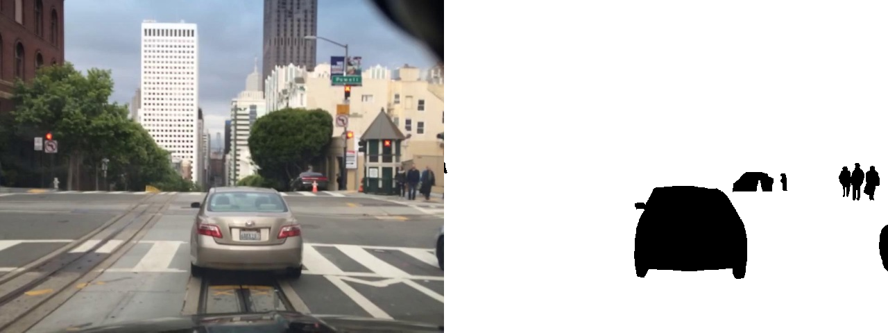
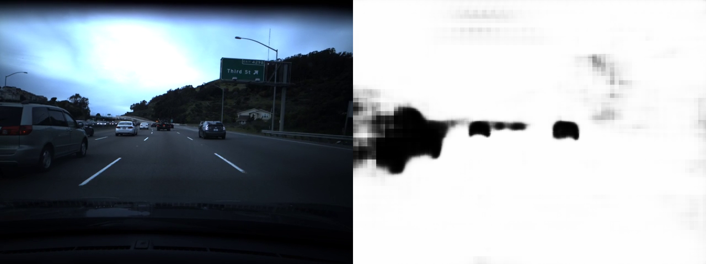
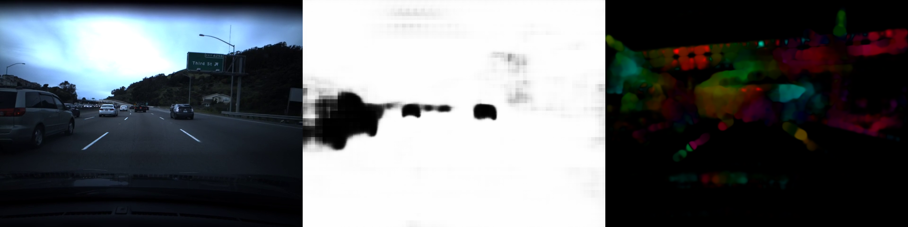
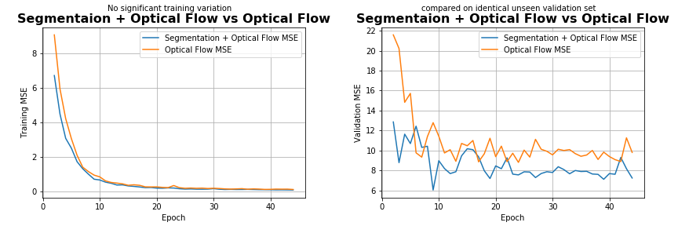
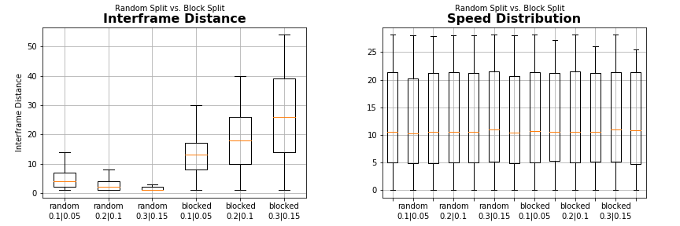

# Overview

This model builds ontop of previous attempts (shout out [dlpbc](https://github.com/dlpbc/comma.ai-speed-challenge) and the
[Stanford team](http://cs229.stanford.edu/proj2017/final-reports/5244226.pdf)) using optical flow and CNN to predict vehicle speed from video.
There are two notable improvements made with my approach:
 1. [Use of a Semantic Segmentation](#semantic-segmentation) The traditional
[Dense Optical Flow](https://docs.opencv.org/3.4/d7/d8b/tutorial_py_lucas_kanade.html) simply tells us the magnitude and direction of motion
in the pixels between two frames.  However this is missing a critical peice of information, which is whether or not that motion is absolute or
relative to the vehicle reference frame.  By adding an additional channel where we label regions that can move relative to the vehicle (ex. other cars, bikes etc.) our model can differentiate and isolate absolute motion of the vehicle in the scene.

 2. [Block based train test split](#block-based-splitter)
 The next issue is with the train validate split, since adjacent frames in a video tend to share similarities a simple randomized split could
 pollute our validation set by selecting frames similar to those in our training set.  I beleive this is a major issue with all currently
 proposed solutions. The block based splitting approach I chose allows me to scale up the training and validation size while preserving their
 distribution and maintaining a minimum distance between frames. This enables reliable training and validation to be performed on a single video.

## Semantic Segmentation
Semanitic Segmentation is basically pixel level classification of an images. I used the [Berkley Deep Drive Dataset](https://bdd-data.berkeley.edu/) which contained 7k training images where pixels are labeled as one of
[40 classes](https://github.com/NikhilPeri/speedchallenge/blob/master/pipelines/segmentation_preprocess.py#L11-L51). I then relabeled each
image with a binary class representing if given region could move between frames (ex. car, bikes, people) of if it was fixed (ex. tree, road,
bridge) this helped reduce the size of my segmentation model.

I then experimented with two segmentation models, a traditional model based on Transpose Convolutional Layers which performs "learned
upsampling" of the image, it is fairly straight forward and best explained by the [following lecture](https://youtu.be/nDPWywWRIRo?t=1346).
Also a more complex [uNet](https://github.com/zhixuhao/unet) which achieved good results on a biomedical imaging dataset.
For this dataset I was able to achieve best results using the

**Transpose Convolutional model with 96.5% accuracy and binary cross entropy of 0.109 on a 480x640 image**.

We can now construct and input with both labeled objects in the scene and optical flow of x and y pixel motion. This helps reduce the
likelyhood our model will over fit to visual queue in the scene and generally makes it more robust even though the model is trained on
a fairly small homogenous dataset.

This is fed into a simple 5 layer CNN which uses Average Pooling for the first 3 layers followed by Max Pooling.  While Average Pooling lacks
sensitivity and is generally not used in classifiers, I found the lack of sensitivity in earlier layers was benifitial in this regression model
helping it better generalize to the validation set. Finally prediction if performed with 4 dense layers and a RelU activation.

In order to demonstrate the effectiveness of the segmentation channel I trained an identical
model using only optical flow and monitored its mean squared error on an identical train and validation set.
As we can see from the validation loss, our segmentation hybrid model is able to better generalize to unseen data points.

**Ultimately through the use of transfer learning it achieves 6.05 MSE**, for
scale [comma.ai](https://twitter.com/comma_ai/status/913196051292499968?lang=en) was able to achieve 4.05.

## Block Based Splitter
The provided training set is fairly small and homogenous which is not ideal for building robust models. A traditional random train test split
would work to some extent in validating the models ability to generalize.  However in video data adjacent frames are extremely similar
therefore it is possible to pollute or validation set with frames close to frames in the training set.

I propose a block based train validate split where by the video is split into blocks of adjacent frames and each block is sampled for a single
purporse (either train or validate).  I evaluated this approach on *inter frame distance* which is a measure of the frame distance between a
validation frame and and its nearest training frame.

Using this method we can sample our video while maintaining a minimum interframe distance between the training/validation groups and  
not altering the distribution of labels across the groups and original video which could introduce unecesarry bias in the model.
